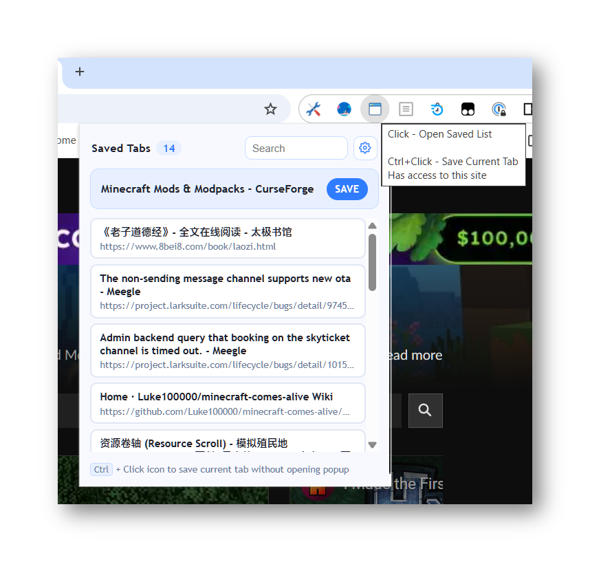

# Save Tabs

A Chrome extension that saves your active tab with one click.

## Features

- **Quick Save** - Click the extension icon to save the current tab
- **Fast Save Mode** - Hold Ctrl and click the icon to save without opening the popup
- **Reopen & Restore** - Click any saved tab to reopen it and remove from the list
- **Search & Filter** - Search through your saved tabs by title or URL
- **Privacy First** - All data stored locally, no external servers

## Installation

1. Download from [Chrome Web Store](https://chromewebstore.google.com/detail/lmiaenpbgbbkgmknifplkfiaphkmjmen?authuser=0&hl=en)
2. Or load as unpacked extension:
   - Open `chrome://extensions/`
   - Enable "Developer mode"
   - Click "Load unpacked"
   - Select the `app` folder

## Usage

### Save a Tab

**Normal Mode:**
1. Click the extension icon to open the popup
2. Click the "SAVE" button to save the current tab

**Fast Mode:**
1. Hold Ctrl key and click the extension icon
2. The current tab is saved instantly (popup won't open)

### Reopen a Saved Tab

1. Click the extension icon to open the popup
2. Click any saved tab from the list
3. The tab opens in a new tab and is removed from the list

### Search Saved Tabs

Type in the search box to filter saved tabs by title or URL.

## Privacy

See [PRIVACY.md](PRIVACY.md) for details.

## License

[MIT](LICENSE)